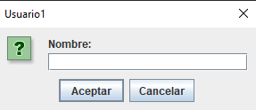
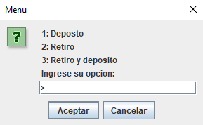
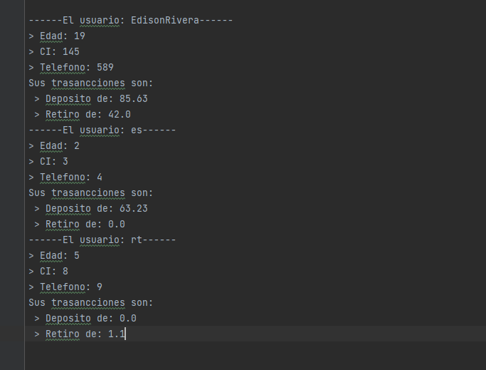
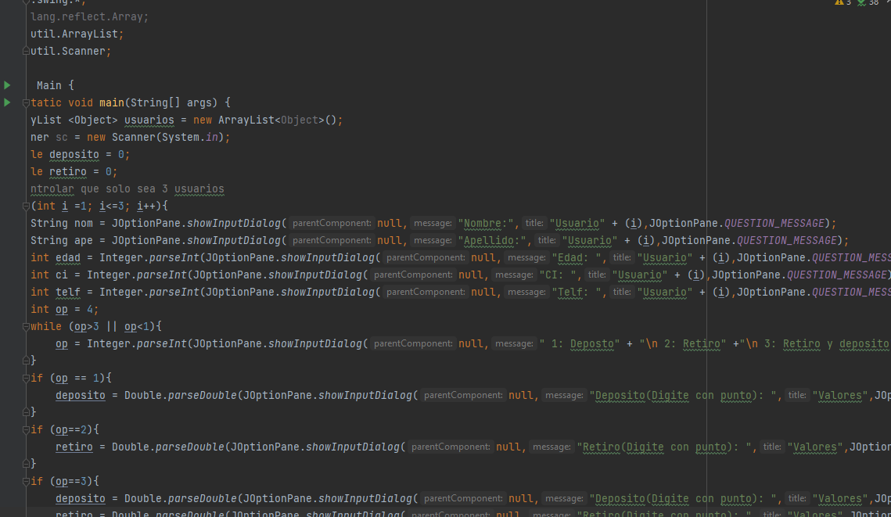
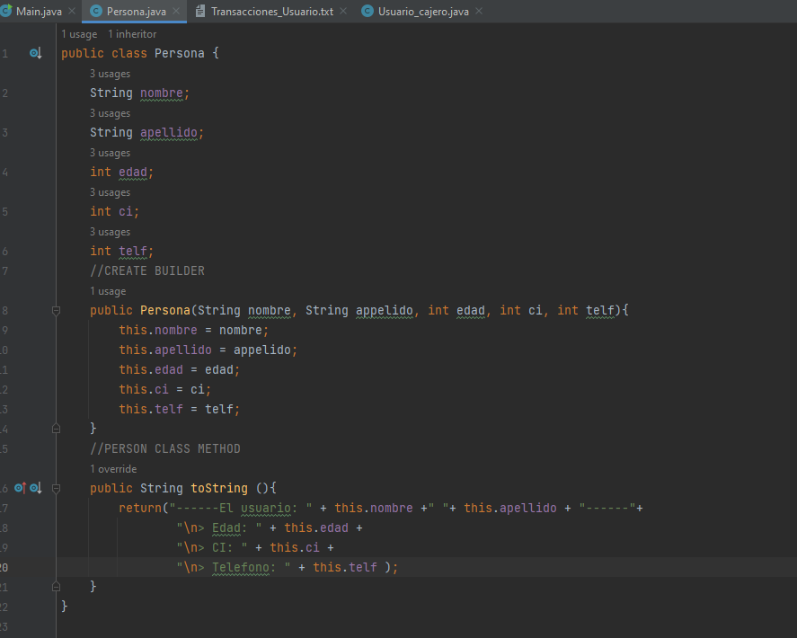
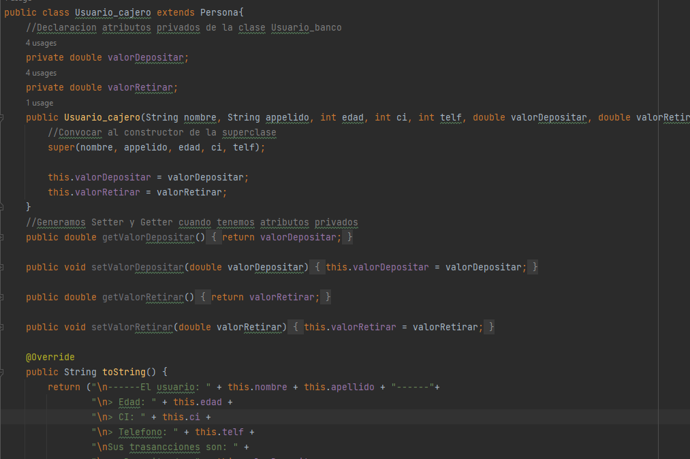

# Examen_bimestral

##Cajero Automatico
#El programa muestra como funciona el registro de 3 usuarios y la seleccion de las transacciones que deseen hacer.
1. Se introduce los datos tipo `string` y de tipo `int`

2. Se introduce la opcion que necesites de tipo `int`

3. Se guarda en un archivo 

#Codigo

